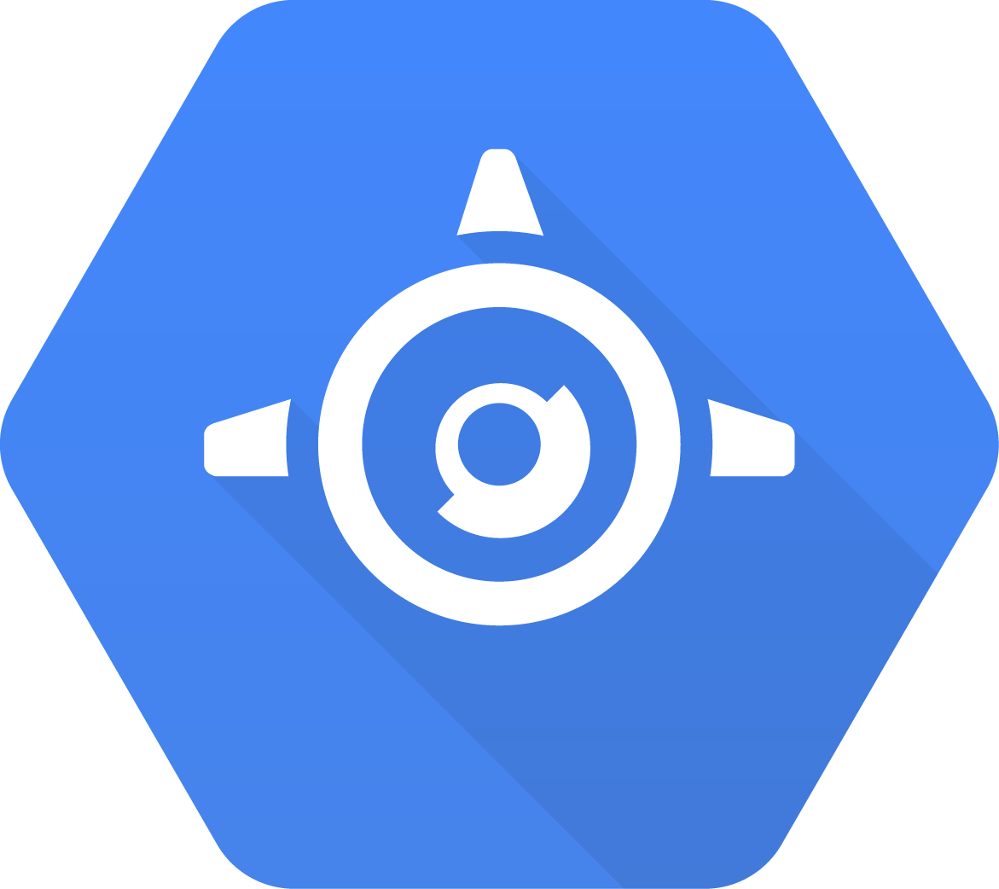

# GServerlessSupportLaravel

<div align="center">
    
    &nbsp;
    
    &nbsp;
    
    &nbsp;
    
    &nbsp;
    
    <br>
    <br>
    
    &nbsp;&nbsp;
    
    &nbsp;&nbsp;
    
</div>
<br>

Google Serverless runtime support package for **Laravel 11.x**.

Supporting Cloud Run & App Engine (Standard Environment).

Based on original work for App Engine ([GaeSupportL5](https://github.com/shpasser/GaeSupportL5) using the `php55` runtime) by [@shpasser](https://github.com/shpasser).

## Functionality
* Google Cloud Operations Suite integration
    * Cloud Logging destination with structured logs (see [docs/logging.md](docs/logging.md)).
    * Cloud Trace (via [opentelemetry](https://github.com/open-telemetry/opentelemetry-php)) (see [docs/trace.md](docs/trace.md))
        * Distributed trace propagation via Guzzle.
* Identity Aware Proxy (IAP) integration (optional, see [docs/iap-auth-verify.md](docs/iap-auth-verify.md))
* Blade View Pre-Compiler (optional, see [docs/blade-pre-compile.md](docs/blade-pre-compile.md))
* Examples for deployment to App Engine from Git via Cloud Build, plus encrypted secrets with Secret Manager (optional, see [docs/cloudbuild.md](docs/cloudbuild.md))

## Installation

**1.** Pull in the package via Composer:

```js
    "require": {
        "affordablemobiles/g-serverless-support-laravel": "~11"
    }
```

**2.** Add the following to `composer.json`:

```json
    "scripts": {
        "post-autoload-dump": [
            "php artisan g-serverless:prepare"
        ]
    },
```

This is to automatically run the artisan command that prepares our app for deployment after composer finishes running: this creates any necessary cache files and if enabled, pre-compiles all of the blade views.

If you are deploying with Cloud Build, `composer install` is likely to run just before packaging/deployment to your chosen serverless product, so this will ensure everything else required runs as part of that step.

**3.** Update the `use` statement at the top of `bootstrap/app.php` from:

```php
use Illuminate\Foundation\Application;
```

to:

```php
use AffordableMobiles\GServerlessSupportLaravel\Foundation\Application;
```

This will enable automatic exception reporting to Cloud Logging & Error Reporting, alongside adjusting the emergency logger to work correctly inside the containerized environment by writing to `stderr`.

**Important:** the Logging API & the Trace API need to be enabled within your project, and the service account being used by your serverless app needs to have IAM permissions to use them:

* [Enable the Logs API](https://console.cloud.google.com/apis/api/logging.googleapis.com/overview) - _append `?project=<project-name>` to the URL if necessary._
* Assign the IAM permission "Logs Writer" to your service account.
* [Enable the Trace API](https://console.cloud.google.com/apis/api/cloudtrace.googleapis.com/overview) - _append `?project=<project-name>` to the URL if necessary._
* Assign the IAM permission "Cloud Trace Agent" to your service account.

**4.** Configure the service providers within `config/app.php` by adding:

```php
    /*
    |--------------------------------------------------------------------------
    | Autoloaded Service Providers
    |--------------------------------------------------------------------------
    |
    | The service providers listed here will be automatically loaded on any
    | requests to your application. You may add your own services to the
    | arrays below to provide additional features to this application.
    |
    */

    'providers' => \Illuminate\Support\ServiceProvider::defaultProviders()->merge([
        // Package Service Providers...
        \AffordableMobiles\GServerlessSupportLaravel\GServerlessSupportServiceProvider::class,
        \AffordableMobiles\GServerlessSupportLaravel\Auth\AuthServiceProvider::class,
    ])->replace([
        \Illuminate\View\ViewServiceProvider::class => \AffordableMobiles\GServerlessSupportLaravel\View\ViewServiceProvider::class,
    ])->toArray(),
```

**5.** Add the following environment variables:

_This can be done either in `.env`, inside `app.yaml`, or as part of the Cloud Run service configuration - we recommend the latter two options where possible._

```
LOG_CHANNEL=stderr
LOG_STDERR_FORMATTER=AffordableMobiles\GServerlessSupportLaravel\Log\Formatter\JsonFormatter

CACHE_DRIVER=array

SESSION_DRIVER=datastore
```

If you are using an external CDN such as Cloudflare, also configure the following environment variable with the name of the HTTP header used for passing the client's IP address:

```
SOURCE_IP_HEADER=CF-Connecting-IP
```

And if you need to disable OpenTelemetry tracing (we highly recommend you leave it enabled), define the following environment variable:

```
G_SERVERLESS_TRACE_STOP=true
```

Also, if running in a development environment, please also set the following:

```
G_SERVERLESS_DEVELOPMENT=true
```

This does several things, such as:

* Alters the local storage location to include `HTTP_HOST`.
* Turns OpenTelemetry tracing on for every request.
* Turns off sticky database connections per instance.

## Upgrading (from Laravel 9.x LTS)

**1.** Update the package version in `composer.json`:

```json
    "require": {
        "affordablemobiles/g-serverless-support-laravel": "~11"
    }
```

**2.** Follow the Laravel upgrade steps for all versions 9.x ... 11.x

**3.** TODO...

(should also document in the upgrade notes to switch from using our report class directly, to using Laravel's new `report($e)` helper now it is available).