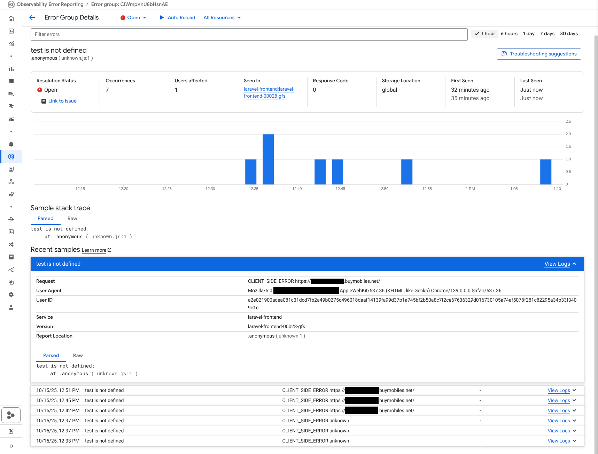

# Client-Side JavaScript Error Reporting for Laravel

This package provides a robust, zero-dependency solution for capturing client-side JavaScript errors and unhandled promise rejections, and logging them to Google Cloud Error Reporting.

It automatically captures and transforms stack traces into a V8-compatible format, ensuring errors are grouped correctly within the Google Cloud console.



## Features

* **Seamless Integration with Google Cloud**: Client-side errors are reported directly to Google Cloud Error Reporting, appearing alongside your server-side exceptions.
* **Correlated Logging**: Errors are logged against the `traceId` of the initial page load request. This allows you to easily find all client-side errors generated from a specific server request in the Cloud Logging console.
* **User Tracking**: When configured, a user identifier is sent with each error report, allowing you to see how many users are affected by a specific issue directly within the Error Reporting UI.

## Installation & Setup

1. **Enable the Service Provider**

In your `bootstrap/app.php` file, add the service provider to the `withProviders` array:

```php
->withProviders([
    // ... other providers
    \AffordableMobiles\GServerlessSupportLaravel\Integration\ErrorReporting\ClientSideJavaScript\ClientSideJavaScriptErrorReportingServiceProvider::class,
])
```

2. **Publish and Configure**

First, publish the package's dedicated configuration file:

```sh
php artisan vendor:publish --tag="js-error-reporter-config"
```

This will create a new configuration file at config/js-error-reporter.php.

Open this file to configure the reporter.

At a minimum, you must enable it:

```php
// config/js-error-reporter.php

return [
    // Enable or disable the entire feature.
    'enabled' => true,

    // ... other options
];
```

3. **Important: Cookie Encryption**

If you are using a `'cookie'` source for the `user_identifier` and that cookie is **not** set by Laravel (e.g., it's a platform-level or legacy cookie), you **must** prevent Laravel from trying to encrypt it.

In `bootstrap/app.php`, add the cookie name to the exceptions list for the `EncryptCookies` middleware:

```php
->withMiddleware(function (Middleware $middleware) {
    $middleware->encryptCookies(except: [
        '__global_session_id', // <-- Add your cookie name here
    ]);
})
```

4. **Include the Blade Partial**

Finally, include the provided Blade partial in your main application layout, inside the `<head>` tag.

This ensures the error handlers are registered as early as possible.

```php
{{-- resources/views/layouts/app.blade.php --}}
<head>
    ...
    {{-- Include the Client-Side Error Reporter --}}
    @include('gss-js-error-reporting::partials.error-reporter-init')
    ...
</head>
```

5. **Configure Authentication (Optional)**

By default, the package protects the reporting endpoint from cross-domain requests by ensuring the Host and Referer headers match.

You can customize this behavior by providing a custom authentication closure in the `config/js-error-reporter.php` file.

Setting the value to null will disable authentication.

```php
// config/js-error-reporter.php

'authentication' => function (\Illuminate\Http\Request $request) {
    // Example: Allow requests only from specific subdomains
    $refererHost = parse_url($request->header('referer'), PHP_URL_HOST);
    return str_ends_with($refererHost, '.yourdomain.com');
},
```

## Improving Stack Trace Accuracy (Optional)

For the most accurate and readable stack traces in Google Cloud Error Reporting, it is highly recommended to generate JavaScript source maps (`.js.map` files) during your asset build process. The error reporting library will automatically use these maps to translate minified production code back into its original, readable source.

**Important Note:** Enabling source maps for production builds will make your original, un-minified JavaScript code (including comments) visible to anyone who uses the browser's developer tools. For most applications, the benefit to debugging outweighs this consideration.

**Enabling Source Maps in Vite**

In your project's `vite.config.js` file, set the `build.sourcemap` option to `true`:

```js
// vite.config.js
import { defineConfig } from 'vite';

export default defineConfig({
    // ...
    build: {
        sourcemap: true,
    },
});
```

**Enabling Source Maps in Laravel Mix**

In your project's `webpack.mix.js` file, chain the `.sourceMaps()` method in your production environment block:

```js
// webpack.mix.js
const mix = require('laravel-mix');

mix.js('resources/js/app.js', 'public/js');

if (mix.inProduction()) {
    mix.version().sourceMaps();
}
```

## Deployment

The package includes versioned JavaScript assets. To ensure the correct assets are always published during your deployment pipeline, make sure the `g-serverless:publish-assets` command is called.

**If you are using the `g-serverless:prepare` command, this is handled for you automatically.**