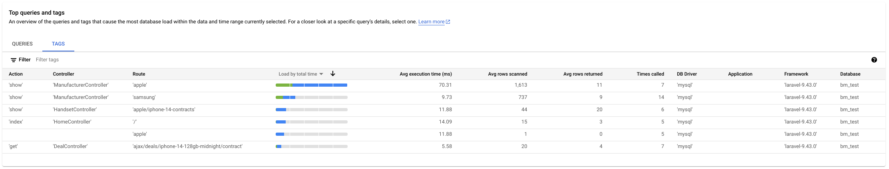

# Cloud SQL Integration

To enable the Cloud SQL integration, enable the `DatabaseServiceProvider` by updating `config/app.php` and adding:

`\AffordableMobiles\GServerlessSupportLaravel\Database\DatabaseServiceProvider::class`

e.g.

```php
    'providers' => ServiceProvider::defaultProviders()->merge([
        ...
        \AffordableMobiles\GServerlessSupportLaravel\Database\DatabaseServiceProvider::class,
        ...
    ])->replace([
        ...
    ])->toArray(),
```

## IAM Authentication

Instead of using a MySQL username/password combination to authenticate with the database, Cloud SQL supports using platform native IAM authentication, to verify your application's identity using strong, OAuth2 credentials from the environment (metadata server):

* [Cloud SQL MySQL: IAM Authentication](https://cloud.google.com/sql/docs/mysql/iam-authentication)
* [Cloud SQL PostgreSQL: IAM Authentication](https://cloud.google.com/sql/docs/postgres/iam-authentication)

Since we'll be using the metadata server, the identity your application will authenticate with is the service account configured for your service: on App Engine, this defaults to `<project-name>@appspot.gserviceaccount.com`, but is [configurable per deployment](https://cloud.google.com/appengine/docs/standard/configure-service-accounts#set_a_version-specific_service_account).

We implement the required functionality in the [IAMAuthentication](../src/AffordableMobiles/GServerlessSupportLaravel/Database/Auth/IAMAuthentication.php) class, which is configured as a [singleton](https://laravel.com/docs/11.x/container#binding-a-singleton) in the [DatabaseServiceProvider](../src/AffordableMobiles/GServerlessSupportLaravel/Database/DatabaseServiceProvider.php#29), so that a single instance of the class is used & the results can be cached during a request.

This can be used in `config/database.php` as follows:

```php
use A1comms\GaeSupportLaravel\Database\Auth\IAMAuthentication;
...

return [
    ...
    'connections' => [
        ...

        'mysql' => [
            ...
            'username'       => static fn () => env('DB_USERNAME', app(IAMAuthentication::class)->username()),
            'password'       => static fn () => env('DB_PASSWORD', app(IAMAuthentication::class)->password()),
            ...
        ],

        ...
    ],
    ...
];
```

As you'll notice from our example, we are using a Closure for each of those configuration options: this isn't supported by Laravel by default, but our [DatabaseServiceProvider](../src/AffordableMobiles/GServerlessSupportLaravel/Database/DatabaseServiceProvider.php) adds support for this.

Using a Closure has two benefits:

* **Lazy loading for performance**: getting the IAM credentials requires several requests to the metadata server, which we can avoid if we are processing a request that doesn't need to connect to the database; without the Closure, these credentials would be fetched at every instantiation of Laravel when the configuration is loaded.
* **OAuth2 token expiry**: the configuration isn't static from when Laravel loads the configuration file, so should the token expire during the request, if/when we try to re-connect to the DB, fresh credentials are provided.

## Multiple Read Replicas

For a high traffic site, especially one that is read-only from a MySQL/PostgreSQL perspective (see using Datastore for [sessions](sessions.md), or with [Eloquent](https://github.com/affordablemobiles/eloquent-datastore)) such as an e-commerce product catalogue, it can be beneficial to support multiple read-replicas when connecting to Cloud SQL: this can facilitate high availability & load sharing.

By default, `config/database.php` looks like this:

```php
return [
    ...
    'connections' => [
        ...

        'mysql' => [
            ...
            'unix_socket' => env('DB_SOCKET', ''),
            ...
        ],

        ...
    ],
    ...
];
```

And using Laravel's native functionality for splitting read/write connections, we can do this:

```php
return [
    ...
    'connections' => [
        ...

        'mysql' => [
            ...
            'read'           => [
                'unix_socket' => env('DB_READ_SOCKET', ''),
            ],
            'write'       => [
                'unix_socket' => env('DB_SOCKET', ''),
            ],
            ...
        ],

        ...
    ],
    ...
];
```

However, you'll notice that Laravel's native functionality only allows you to specify a single socket for each type (read/write).

Using our [DatabaseServiceProvider](../src/AffordableMobiles/GServerlessSupportLaravel/Database/DatabaseServiceProvider.php), we support using an array for those values, allowing you do to this:

```php
return [
    ...
    'connections' => [
        ...

        'mysql' => [
            ...
            'read'           => [
                'unix_socket' => collect(
                    explode('|', env('DB_INSTANCES', 'invalid'))
                )->map(static fn ($instance) => '/cloudsql/'.$instance)->toArray(),
            ],
            'write'       => [
                'unix_socket' => '/cloudsql/invalid',
            ],
            ...
        ],

        ...
    ],
    ...
];
```

You'll notice that for the write socket, we are specifying `/cloudsql/invalid`, as this demo application is entirely read-only: any attempts to write to the DB are denied, as the socket defined won't work if it tries to connect.

For the read configuration, you'll see we are creating an array from the `DB_INSTANCES` environment variable, which is delimited by `|` and just contains the Cloud SQL instance ID, not the full socket path, e.g.:

```
DB_INSTANCES=demo-project:europe-west1:frontend-replica-1|demo-project:europe-west1:frontend-replica-2
```

[DatabaseServiceProvider](../src/AffordableMobiles/GServerlessSupportLaravel/Database/DatabaseServiceProvider.php) will use that array when connecting to the DB, by using the following logic:

* If this App Engine/Cloud Run instance has connected to the DB before, connect to the same instance before (improves performance).
    * If that fails (i.e. DB instance has gone offline), remove the failed instance from the array, then fall into the logic below.
* Randomize the order of the array, so we aren't always connecting to the same instance.
* Try to connect to each DB instance configured in the array in sequence, failing over to the next if the connection fails.
* On successful connection, create the cache entry required for the first step.

## Query Insights

Cloud SQL's Query Insights functionality is a great tool for assessing the query performance within your application:

* [Cloud SQL MySQL: Query Insights](https://cloud.google.com/sql/docs/mysql/using-query-insights)
* [Cloud SQL PostgreSQL: Query Insights](https://cloud.google.com/sql/docs/postgres/using-query-insights)

By including [eloquent-sqlcommenter](https://github.com/affordablemobiles/eloquent-sqlcommenter), your application will by default include contextual information in SQL queries submitted to the Cloud SQL instance (as a trailing comment, see [sqlcommenter](https://google.github.io/sqlcommenter/)).

