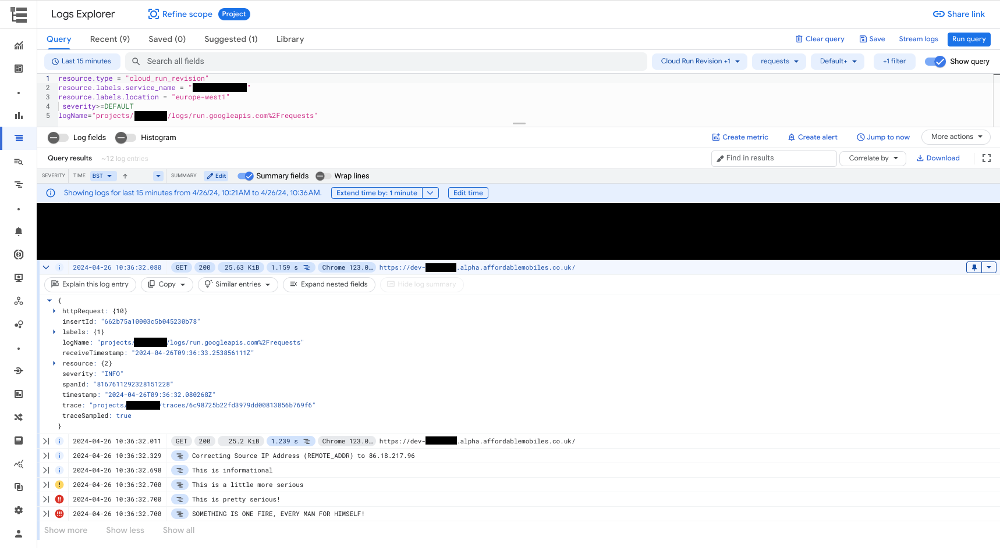
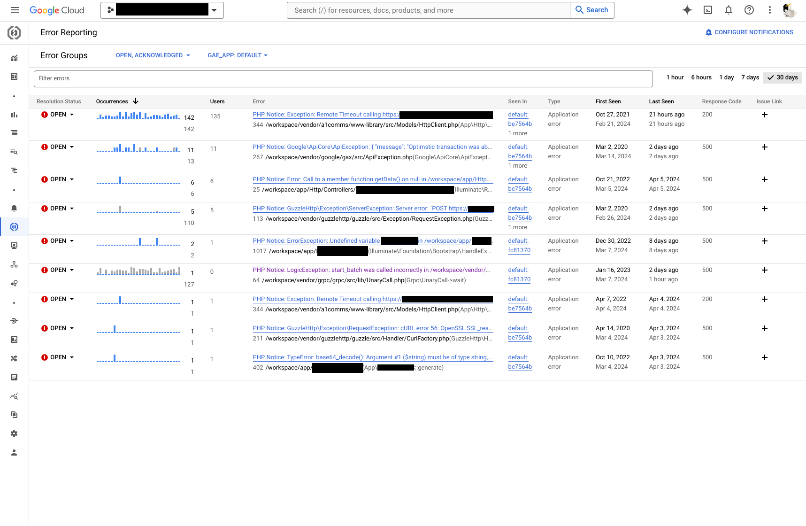

# Cloud Logging Integration

This library includes support for fully integrating with Cloud Logging in GCP using the most performant method on each platform (writing to `stderr`).

**The main stand-out feature is linking log entries to the request that generated them**, which you'll see in the below screenshot:

We've found this to be a fantastic developer friendly feature, which has a dramatic impact on the ease of debugging any application deployed on the platform.

This log attribution is accomplished by tagging each structured log entry with relevant metadata, including the trace ID generated by the platform & passed in the `X-Cloud-Trace-Context` header (see [Cloud Trace Integration](trace.md)).

## Error Reporting

Taking this a step further, we also have out-of-the-box integration with GCP's Error Reporting for logging exceptions:

Laravel's exception handler is automatically configured to log exceptions to Cloud Logging, but in a specific format that is recognised by Error Reporting and tagged with all relevant metadata.

To ensure a full stack trace is preserved, we submit these exception reports directly to the [Logging API](https://cloud.google.com/logging/docs/api/enable-api), so you'll need to ensure:
* The Logging API is [enabled](https://cloud.google.com/logging/docs/api/enable-api) for your project.
* The service account running your app has `Logs Writer` permissions.

To log the users affected by any exception, by default the currently signed in user via Google's IAP is used: if you are using another login method, define `ERROR_REPORTING_USER` with the username, or alternatively for an unauthenticated app, the session ID.