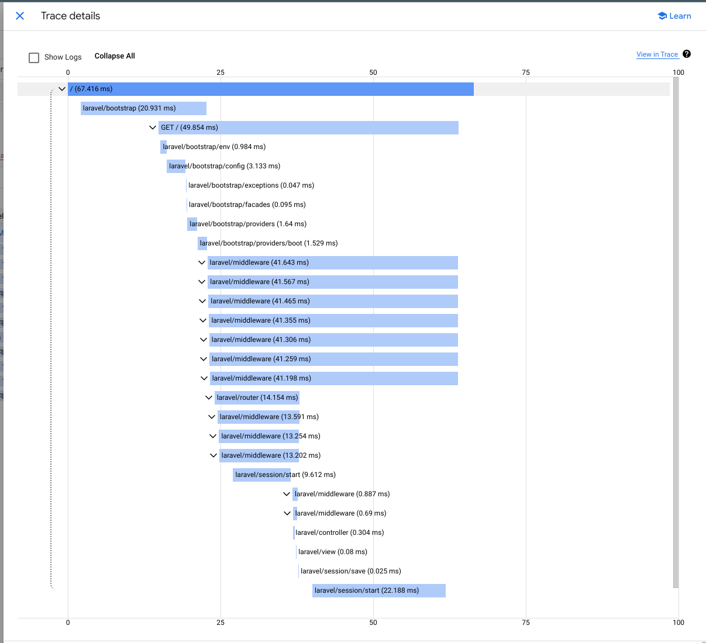

# Cloud Trace Integration

This package includes built in support for tracing important events during a request to Cloud Trace.

By default, this includes:
* Laravel startup, as `laravel/bootstrap`.
  * From first entering `public/index.php`, to Laravel being fully booted.
* Extended Laravel bootstrapping view (disabled by default)
  * Application configuration, i.e. `Application::configure(...)->...->create()`
  * Request capture
  * Environment variables init
  * Configuration init
  * Providers init
  * Exception handler init
  * Providers boot
* Laravel's HTTP request lifecycle
  * Session handler
  * Middleware
  * Router
  * Controller
  * Blade view compile/render
* External calls / RPC
  * Guzzle (HTTP(s)) including trace propagation.
  * Laravel cache (as events)
  * Laravel DB / Eloquent SQL
  * Datastore (Eloquent by default, GDS aka php-gds available)

It is also possible to extend this functionality with your own trace hooks, see [Customization](#customization) below.

## Example



## Architecture

Tracing is implemented using OpenTelemetry, mainly via it's [PECL extension](https://github.com/open-telemetry/opentelemetry-php-instrumentation) that allows hooking functions during execution, based on [zend_observer](https://www.datadoghq.com/blog/engineering/php-8-observability-baked-right-in/).

This library will automatically load all the tracing functionality when running on Google's serverless platform, as long as the `opentelemetry` extension is loaded, which usually means putting a `php.ini` in the document root before deploying with the line, `extension=opentelemetry.so`.

You can stop this by defining an environment variable as: `G_SERVERLESS_TRACE_STOP=true`

A request's trace ID is loaded from the `X-Cloud-Trace-Context` request header and used for application logging (see [here](logging.md)), as well as for tracing - Google defines how frequently requests are traced, documented as:

> For App Engine and Cloud Run, requests are sampled at a maximum rate of 0.1 requests per second for each instance.

## Customization

Ensuring relevant parts of the request are traced is handled by instrumentation, which are classes that implement the [InstrumentationInterface](../src/AffordableMobiles/GServerlessSupportLaravel/Trace/Instrumentation/InstrumentationInterface.php) interface and are loaded as part of [src/preload.php](../src/preload.php) during the composer autoloader initialisation.

By default, instrumation is loaded from [InstrumentationLoader](../src/AffordableMobiles/GServerlessSupportLaravel/Trace/InstrumentationLoader.php), which implements the [InstrumentationLoaderInterface](../src/AffordableMobiles/GServerlessSupportLaravel/Trace/InstrumentationLoaderInterface.php).

When the autoloader code runs, it first checks for the existance of `App\Trace\InstrumentationLoader` and if it exists, uses that instead: so if you want to customize what instrumentation is loaded, you could implement `App\Trace\InstrumentationLoader` like this (in `app/Trace/InstrumentationLoader.php`):

```php
<?php

declare(strict_types=1);

namespace App\Trace;

use AffordableMobiles\GServerlessSupportLaravel\Trace\InstrumentationLoader as BaseInstrumentationLoader;
use AffordableMobiles\GServerlessSupportLaravel\Trace\Instrumentation\Laravel\LaravelExtendedInstrumentation;

/**
 * Class to return the trace instrumentation to load.
 */
class InstrumentationLoader extends BaseInstrumentationLoader
{
    /**
     * Static method to get the list of trace instrumentation to load.
     */
    public static function getInstrumentation()
    {
        return array_merge(
            parent::getInstrumentation(),
            [
              LaravelExtendedInstrumentation::class,
            ],
        );
    }
}
```

or, if you only wanted to load your own instrumentation, you could implement it like this:

```php
<?php

declare(strict_types=1);

namespace App\Trace;

use App\Trace\Instrumentation\Models\CustomerInstrumentation;
use AffordableMobiles\GServerlessSupportLaravel\Trace\InstrumentationLoaderInterface;

/**
 * Class to return the trace instrumentation to load.
 */
class InstrumentationLoader implements InstrumentationLoaderInterface
{
    /**
     * Static method to get the list of trace instrumentation to load.
     */
    public static function getInstrumentation()
    {
        return [
          CustomerInstrumentation::class,
        ];
    }
}
```

with `CustomerInstrumentation` looking something like this (as an example, putting a span around a method named `calculate`):

```php
<?php

declare(strict_types=1);

namespace App\Trace\Models;

use App\Models\Customer;
use AffordableMobiles\GServerlessSupportLaravel\Trace\Instrumentation\InstrumentationInterface;
use AffordableMobiles\GServerlessSupportLaravel\Trace\Instrumentation\SimpleSpan;
use OpenTelemetry\API\Instrumentation\CachedInstrumentation;

use function OpenTelemetry\Instrumentation\hook;

class CustomerInstrumentation implements InstrumentationInterface
{
    /** @psalm-suppress ArgumentTypeCoercion */
    public const NAME = 'customer-model';

    public static function register(CachedInstrumentation $instrumentation): void
    {
        hook(
            Customer::class,
            'calculate',
            pre: static function (Customer $model, array $params, string $class, string $function, ?string $filename, ?int $lineno) use ($instrumentation): void {
                SimpleSpan::pre(
                    $instrumentation,
                    'model/customer/calculate',
                    [
                        'id' => $model->id,
                    ]
                );
            },
            post: static function (Customer $model, array $params, mixed $returnValue, ?\Throwable $exception): void {
                SimpleSpan::post([
                  'calculated_value' => $returnValue,
                ]);
            },
        );
    }
}
```

As you can see, the simplest way to add trace spans on hooked functions is with [SimpleSpan](../src/AffordableMobiles/GServerlessSupportLaravel/Trace/Instrumentation/SimpleSpan.php), so please check it out for the functionality supported:

The main things to note are the ability to add contextual attributes both before hooked function execution (`pre` closure above), and after (`post` closure above).

## Optional Instrumentation

Following the customization guide above, there are several instrumentation modules you can load that aren't loaded by default:

* [Laravel Extended Startup Information](../src/AffordableMobiles/GServerlessSupportLaravel/Trace/Instrumentation/Laravel/LaravelExtendedInstrumentation.php)
* [Datastore via GDS aka php-gds](../src/AffordableMobiles/GServerlessSupportLaravel/Trace/Instrumentation/Datastore/GDS/GDSInstrumentation.php)